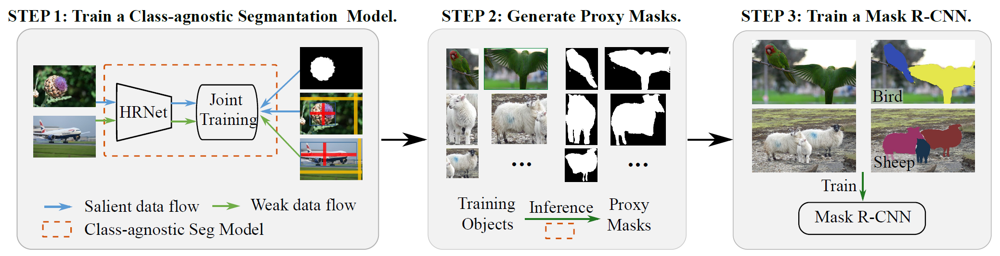

# Weakly-supervised Instance Segmentation via Class-agnostic Learning with Salient Images.(CVPR 2021)

This is the official code of the paper Weakly-supervised Instance Segmentation via Class-agnostic Learning with Salient Images, by Xinggang Wang, Jiapei Feng, Bin Hu, Qi Ding, Longjin Ran, Xiaoxin Chen, Wenyu Liu.


<!-- TABLE OF CONTENTS -->
<details open="open">
  <summary>Table of Contents</summary>
  <ol>
    <li>
      <a href="#Introduction">Introduction</a>
    </li>
    <li>
      <a href="#getting-started">Getting Started</a>
      <ul>
        <li><a href="#prerequisites">Prerequisites</a></li>
        <li><a href="#installation">Installation</a></li>
      </ul>
    </li>
    <li><a href="#usage">Usage</a></li>
    <li><a href="#Citation">Citation</a></li>
    <li><a href="#license">License</a></li>
    <li><a href="#acknowledgements">Acknowledgements</a></li>
  </ol>
</details>


<!--INTRODUCTION-->
## Introduction
<p align="center"></p>

Weakly-supervised instance segmentation uses coarser annotations to acquire a high-precision instance segmentation model, such as bounding boxes. This "box-to-seg" process is a class-agnostic process. Our motivation is to learn a model that achieves generic class-agnostic segmentation. 

The training process is divided into three steps. First, we obtain a class-agnostic segmentation model through the joint training of box-supervised dataset and salient object segmentation dataset. Second, we use the class-agnostic segmentation model to produce high-quality predictions for training instances. Those segmentation predictions are merged to generate proxy instance masks for training images. Finally, we re-train a Mask R-CNN with proxy masks.

<!-- GETTING STARTED -->
## Getting Started

### Prerequisites

This is an example of how to list things you need to use the software and how to install them.
* Python>=3.6, PyTorch
* Augmented PASCAL VOC 2012 (10582 images for training)
* 


* 
* Python 3.7, PyTorch 1.1.0, and more in requirements.txt
* 
PASCAL VOC 2012 devkit
NVIDIA GPU with more than 1024MB of memory
  ```sh
  npm install npm@latest -g
  ```

### Installation

1. Get a free API Key at [https://example.com](https://example.com)
2. Clone the repo
   ```sh
   git clone https://github.com/your_username_/Project-Name.git
   ```
3. Install NPM packages
   ```sh
   npm install
   ```
4. Enter your API in `config.js`
   ```JS
   const API_KEY = 'ENTER YOUR API';
   ```


<!-- USAGE EXAMPLES -->
## Usage

Use this space to show useful examples of how a project can be used. Additional screenshots, code examples and demos work well in this space. You may also link to more resources.

_For more examples, please refer to the [Documentation](https://example.com)_

<!-- CITATION -->
## Citation
If you find the code useful in your research, please consider citing:
```BibTeX
@inproceedings{wang2021boxcaseg,
  title     =  {Weakly-supervised Instance Segmentation via Class-agnostic Learning with Salient Images},
  author    =  {Wang, Xinggang and Feng, Jiapei and Hu, Bin and Ding, Qi and Ran, Longjin and Chen, Xiaoxin and Liu, Wenyu},
  booktitle =  {Proc. IEEE Conf. Computer Vision and Pattern Recognition (CVPR)},
  year      =  {2021}
}
```

<!-- LICENSE -->
## License
Distributed under the MIT License. See `LICENSE` for more information.

<!-- ACKNOWLEDGEMENTS -->
## Acknowledgements
* We thank NSFC, Zhejiang Laboratory and VIVO Inc for their support to this project.
* The code is borrowed from [HRNet](https://github.com/HRNet/HRNet-Semantic-Segmentation) and [Mask R-CNN](https://github.com/facebookresearch/maskrcnn-benchmark).
